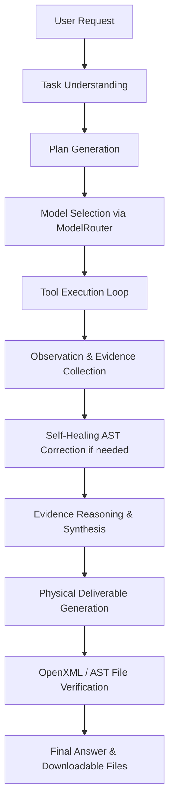

# KAVAAI Sovereign — Beginner's Code Map

Welcome to **KAVAAI Sovereign**! This guide is written specifically for developers of any experience level who want to understand how an advanced, sovereign, air-gapped industrial AI platform is structured and how every file works together.

---

## 1. Where Does the Application Start?

The application has two primary starting points depending on whether you want to interact via the web or programmatically:

### A. Web Application Entry Point (Recommended)
- **File**: `backend/main.py`
- **Command to run**: `python backend/main.py`
- **What it does**:
  1. Activates the application-level **Air-Gap Outbound Guard** (`sovereignty_monitor.py`) to guarantee that 0 data escapes to external cloud endpoints.
  2. Auto-seeds the local vector database with default SOPs and manuals (`data/knowledge_base/`).
  3. Launches the Flask REST API on `http://127.0.0.1:8000`.
  4. Directly serves the frontend user interface at `http://127.0.0.1:8000/`.

### B. Command-Line (CLI) Entry Point
- **File**: `scripts/cli_investigate.py`
- **Command to run**: `python scripts/cli_investigate.py`
- **What it does**: Takes a technical question via standard input (e.g. `"Is Machine 101 overheating?"`), invokes the `AgentOrchestrator`, generates verified deliverables in `output/`, and prints a human-readable investigation report to your console.

---

## 2. Frontend Architecture

The frontend is an **Industrial AI Workbench** designed for mission-critical reliability. It uses standard vanilla web technologies (HTML5, CSS3, JavaScript ES6) with zero heavy frameworks, so it loads instantly in any browser.

```
frontend/
├── index.html        # Main 8-view workbench structure
├── app.js            # Frontend application logic & API client
├── style.css         # Dark cybernetic industrial design
└── streamlit_app.py  # Alternative legacy dashboard (optional)
```

- **`frontend/index.html`**:
  Contains the 8 main industrial views:
  1. **Overview**: Live host telemetry, GPU detection, model statuses, and air-gap indicators.
  2. **Agent Workspace**: The core interactive cockpit featuring dynamic plan execution checklists, tool tags, and result summaries.
  3. **Documents**: Uploaded inspection reports, local manuals, and indexing controls.
  4. **Knowledge Base**: Indexed SOP repository and similarity search test bench.
  5. **Vision**: Multimodal visual inspection analyzer with image previews.
  6. **Code Lab**: AST sandbox code tester with real-time variable inspector.
  7. **Deliverables**: Download cards for generated DOCX, XLSX, PPTX, CSV, TXT, and PY files.
  8. **Security Monitor**: Live audit log of model invocations, tool runs, and blocked WAN attempts.

- **`frontend/app.js`**:
  - Periodically polls `GET /telemetry` every 3 seconds to update gauges.
  - Sends user requests to `POST /investigate` or `POST /api/agent/run`.
  - Dynamically renders the agent's multi-step plan, model selection, tool observation cards, and downloadable file cards.

- **`frontend/style.css`**:
  - Clean, high-contrast dark theme (#0b0f14 background, cybernetic blue `#00a3ff`, and emerald green `#10b981`).
  - Fluid glassmorphism layouts and responsive grid cards.

---

## 3. Backend Architecture

The backend exposes a clean REST API built on Flask, enforcing local-only loopback (`127.0.0.1`).

```
backend/
├── main.py               # Flask application & route registry
└── config/
    └── settings.py       # Centralized paths, model roles & environment variables
```

### Key API Routes in `backend/main.py`:
- `GET /`: Serves the frontend workbench (`index.html`).
- `POST /investigate`: Main orchestration endpoint for industrial diagnostic workflows.
- `POST /api/agent/run`: General agent task endpoint.
- `GET /telemetry`: Returns live telemetry (temperature, fan RPM, pressure, coolant level).
- `GET /api/system/status`: Returns host hardware metrics (CPU, RAM, GPU, OS platform).
- `GET /sovereignty`: Returns real-time air-gap audit metrics and active model mappings.
- `GET /api/sovereignty/audit`: Returns persistent JSONL audit event logs.
- `POST /api/sovereignty/test-guard`: Live demonstration verifying that external WAN requests are blocked.
- `GET /api/tools`: Catalog of all 12 registered safe local tools.
- `POST /api/tools/execute`: Direct tool execution endpoint.
- `GET /api/deliverables`: Lists generated files available for download in `output/`.
- `GET /api/deliverables/download/<filename>`: Safely downloads generated deliverable files.

---

## 4. Agent Lifecycle (How the AI Thinks & Acts)

The agent logic lives in `backend/agent/orchestrator.py` (`AgentOrchestrator`). When a user submits a prompt, the system executes this sequential lifecycle:



1. **Task Understanding (`_understand_task`)**:
   Classifies the intent: Is this an Approval Note generation? A coding and statistics calculation? Or an image inspection?
2. **Plan Generation (`_create_plan`)**:
   Constructs an explicit 6-step or 10-step execution plan with designated tools and descriptions.
3. **Model Selection (`route_task`)**:
   Queries `backend/agent/router.py` to assign the best local model role (e.g. `CODING_MODEL` for scripts, `VISION_MODEL` for images, `REASONING_MODEL` for synthesis).
4. **Execution & Self-Healing (`_execute_plan_steps`)**:
   Executes each step sequentially. If safe Python code fails, the agent intercepts the syntax or runtime error and applies automated self-healing AST repair.
5. **Reasoning Over Evidence (`_reason_over_evidence`)**:
   Combines sensor telemetry, retrieved SOP text, and vision observations. It enforces a **zero-hallucination constraint**: unmeasured metrics are never invented.
6. **Physical Deliverable Generation (`_generate_final_deliverable`)**:
   Calls `DeliverableGenerator` to generate real files on disk (DOCX, XLSX, PPTX, CSV, TXT, PY).
7. **Integrity Verification (`_verify_results`)**:
   Validates file structure (OpenXML ZIP tables, AST compilation) before returning downloads to the user.

---

## 5. Models & Local AI Integration

All AI model interactions live in `backend/agent/router.py`.

- **Zero Cloud Dependence**: Connects strictly to local Ollama (`http://localhost:11434`).
- **Model Roles**:
  - `REASONING_MODEL`: `qwen2.5:7b` (High-precision industrial reasoning and report drafting).
  - `CODING_MODEL`: `qwen2.5:7b` (Python calculation and telemetry statistics).
  - `VISION_MODEL`: `qwen2.5vl:7b` (Multimodal image inspection).
  - `EMBEDDING_MODEL`: `all-MiniLM-L6-v2` (Local 384-dimensional vector embeddings).
- **Graceful Heuristic Fallback**:
  If Ollama is temporarily offline, the router automatically falls back to deterministic local rule engines and clearly marks output with `(Offline Fallback)`. Zero fake metrics are ever shown.

---

## 6. Retrieval-Augmented Generation (RAG)

The RAG subsystem lives in `backend/rag/` and connects confidential on-premise documents to AI queries.

```
backend/rag/
├── knowledge_connector.py    # Semantic search & top-k retrieval
└── indexer.py                # Document chunker & ChromaDB database seeder
```

### The RAG Pipeline:
1. **Document Ingestion**: Reads PDFs, manuals, and reports from `data/knowledge_base/`.
2. **Structured Chunking**: Chunks text by section and page, preserving exact page numbers and document titles for citations.
3. **Local Embeddings**: Converts text chunks into numerical vectors using SentenceTransformer `all-MiniLM-L6-v2` without sending text over the internet.
4. **Local Vector Database**: Stores embeddings persistently in local ChromaDB (`data/vector_store/` or `chroma_db/`).
5. **Semantic Retrieval**: Queries the database using cosine similarity, returning exact source file, page number, similarity match %, and relevant excerpt.

---

## 7. Multimodal Document Intelligence & Vision

Document intelligence lives in `backend/multimodal/document_intelligence.py`:
- **Document Triage (`inspect_document`)**: Determines file format (PDF, PNG, DOCX, TXT) and whether a PDF is digital text or a scanned image.
- **Local OCR (`extract_text_via_ocr`)**: Uses local Tesseract OCR to read text from scanned physical pages.
- **Multimodal Vision (`analyze_page_images_multimodal`)**: Encodes page images and sends them to local `qwen2.5vl:7b` to inspect equipment for physical defects, radiator fin dust, or oil leaks.

---

## 8. Safe Tool System

Tools live in `backend/tools/registry.py` (`ToolRegistry`). Each tool inherits from `BaseTool` and defines an explicit JSON input schema and validation check:

| Tool Name | What It Does |
| :--- | :--- |
| `READ_FILE` | Safely reads local workspace files (PDF, CSV, TXT, JSON). |
| `WRITE_FILE` | Writes output files strictly inside the approved `output/` directory. |
| `SEARCH_KNOWLEDGE_BASE`| Queries confidential local SOPs, manuals, and reports. |
| `OCR_DOCUMENT` | Extracts text from scanned reports using local OCR. |
| `ANALYZE_IMAGE` | Inspects industrial machinery images using local vision models. |
| `EXECUTE_PYTHON` | Runs safe mathematical and statistical scripts in the AST sandbox. |
| `READ_SPREADSHEET` | Inspects Excel (XLSX) and CSV spreadsheets safely without macros. |
| `WRITE_SPREADSHEET` | Creates formatted Excel spreadsheets with headers and rows. |
| `VERIFY_FILE` | Validates OpenXML schemas (DOCX/XLSX/PPTX) and Python AST syntax. |
| `GENERATE_APPROVAL_NOTE`| Generates formal DOCX engineering approval notes. |
| `GENERATE_PPTX` | Generates executive slide deck presentations. |
| `RETURN_DELIVERABLES` | Packages verified files for user download. |

---

## 9. AST Python Sandbox

The sandbox subsystem lives in `backend/sandbox/`:
- **`backend/sandbox/security.py` (`ToolSecurity`)**:
  - Uses Python's `ast` module to statically parse code before execution.
  - Rejects dangerous imports (`os`, `sys`, `subprocess`, `socket`, `requests`).
  - Rejects dangerous builtins (`eval`, `exec`, `__import__`, `globals`).
  - Enforces path containment to prevent directory traversal attacks (`..`).
- **`backend/sandbox/executor.py` (`ExecutePythonTool`)**:
  - Builds an isolated Python execution environment with safe builtins (`abs`, `min`, `max`, `sum`, `len`, `math`, `statistics`, `csv`, `json`).
  - Redirects `sys.stdout` to capture console output cleanly.
  - Automatically filters non-serializable objects (functions, generators) to ensure clean JSON responses.

---

## 10. Real Deliverable Generation

Deliverable generation lives in `backend/documents/deliverable_generator.py` (`DeliverableGenerator`):
- **DOCX**: Microsoft Word documents using `python-docx` with navy/cyan corporate headers, metadata summary tables, evidence matrices, and sign-off blocks.
- **XLSX**: Microsoft Excel spreadsheets using `openpyxl` with styled headers, thin borders, and color-coded status cells (green for NORMAL, amber for WARNING, red for CRITICAL).
- **PPTX**: PowerPoint slide presentations using `python-pptx` with title banners, bullet hierarchies, and executive metrics.
- **CSV & TXT**: Clean delimited datasets and monospace engineering audit reports.
- **PY**: Standalone, reproducible Python validation scripts with unit tests and assertions.
- **Verification Engine (`verify_deliverable`)**: Inspects OpenXML ZIP structure (`word/document.xml`, `xl/workbook.xml`, `ppt/presentation.xml`) to guarantee files are physically valid before presenting them to users.

---

## 11. Security & Sovereignty Audit Layer

Security monitoring lives in `backend/security/sovereignty_monitor.py` (`SovereigntyMonitor`):
- **Application-Level Outbound Guard**: Intercepts outgoing HTTP/socket connection attempts. If an unauthorized WAN call (such as to `api.openai.com`) is attempted, the guard raises a `SovereigntySecurityException` and blocks it immediately.
- **Endpoint Classifier**: Classifies destinations as `LOCAL` (127.0.0.1, localhost, approved subnet), `BLOCKED`, or `EXTERNAL`.
- **Persistent JSONL Audit Trail**: Every AI invocation, tool run, document read, and blocked request is timestamped and recorded in `output/sovereignty_audit.jsonl`.
- **Zero Fake Metrics**: Real numbers only. If 0 external calls were made, the audit log shows 0 external calls because the outbound guard is actively monitoring the network adapter.

---

## 12. Recommended Learning Order for Beginners

If you want to understand the codebase step-by-step, follow this sequence:

1. **`backend/config/settings.py`**: Understand how paths, model names, and settings are configured.
2. **`frontend/index.html` & `frontend/app.js`**: See how user interactions and buttons trigger API requests.
3. **`backend/main.py`**: Follow how incoming HTTP requests arrive and are dispatched.
4. **`backend/agent/orchestrator.py`**: Trace how the agent receives a prompt and builds an execution plan.
5. **`backend/agent/router.py`**: See how tasks are classified and routed to local Ollama models.
6. **`backend/tools/registry.py`**: Discover how safe tools are registered and invoked.
7. **`backend/sandbox/security.py` & `backend/sandbox/executor.py`**: Learn how AST code validation and sandboxed execution work safely.
8. **`backend/rag/knowledge_connector.py`**: Understand vector embeddings and ChromaDB retrieval.
9. **`backend/multimodal/document_intelligence.py`**: Learn how PDFs are parsed, OCR is applied, and images are analyzed.
10. **`backend/documents/deliverable_generator.py`**: See how native DOCX, XLSX, and PPTX files are built from scratch.
11. **`backend/security/sovereignty_monitor.py`**: Explore how air-gap enforcement and audit logging work under the hood.
