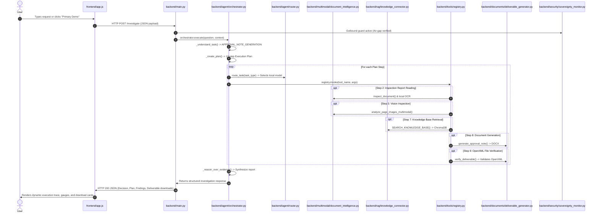

# KAVAAI Sovereign — Request Flow Architecture

This document explains the step-by-step lifecycle of a real industrial user request through the KAVAAI Sovereign codebase, specifying the exact files, classes, methods, inputs, and outputs at each stage.

---

## The Scenario

**User Prompt**:
> *"Analyze this inspection report, identify important findings, retrieve the relevant local SOP/manual information, assess the findings using available evidence, and generate an approval note."*

---

## Detailed Step-by-Step Code Path



---

### Step 1: User Action in Frontend
- **File**: `frontend/index.html`, `frontend/app.js`
- **Function**: `handleInvestigate()` / Click event listener on `#btn-primary-demo`
- **Input**:
  - `question`: `"Analyze this inspection report, identify important findings, retrieve the relevant local SOP/manual information, assess the findings using available evidence, and generate an approval note."`
  - `image_path`: `"data/sample/machine101_inspection.png"` (or uploaded document)
- **Output**: HTTP `POST http://127.0.0.1:8000/investigate` with JSON body:
  ```json
  {
    "question": "Analyze this inspection report...",
    "image_path": "data/sample/machine101_inspection.png"
  }
  ```

---

### Step 2: REST API Endpoint Receives Request
- **File**: `backend/main.py`
- **Function**: `investigate()` (Route: `@app.route("/investigate", methods=["POST"])`)
- **Process**:
  1. Validates non-empty input.
  2. Forwards request into the agent engine:
     ```python
     res = orchestrator.execute(
         user_request=question,
         context=data,
         generate_deliverables=True,
         verbose=True
     )
     ```
- **Security Check**: `sovereignty_monitor.install_outbound_guard` intercepts any unexpected outgoing network requests, guaranteeing zero external WAN communication.

---

### Step 3: Task Understanding & Intent Classification
- **File**: `backend/agent/orchestrator.py`
- **Class**: `AgentOrchestrator`
- **Method**: `_understand_task(state: AgentState)`
- **Input**: `state.user_request`
- **Logic**: Analyzes keywords (`approval note`, `inspection report`, `SOP`, `calculate`, `python`).
- **Output**:
  ```python
  state.task_understanding = {
      "intent": "approval_note_workflow",
      "target_model": "qwen2.5:7b",
      "is_approval_note": True,
      "requires_multimodal": True,
      "task_type": "APPROVAL_NOTE_GENERATION"
  }
  ```

---

### Step 4: Dynamic Plan Generation
- **File**: `backend/agent/orchestrator.py`
- **Method**: `_create_plan(state: AgentState)`
- **Output**: Explicit 10-step plan array:
  1. Read uploaded inspection report (`READ_FILE`)
  2. Detect document type and extract text via local OCR (`OCR_DOCUMENT`)
  3. Analyze visual features of machine components (`ANALYZE_IMAGE`)
  4. Create formal execution plan (`model_router`)
  5. Select appropriate local AI model (`model_router`)
  6. Search local knowledge base for SOP limits (`SEARCH_KNOWLEDGE_BASE`)
  7. Extract and structure cross-modal evidence (`reasoning_engine`)
  8. Generate actual DOCX Approval Note (`GENERATE_APPROVAL_NOTE`)
  9. Verify DOCX file integrity and XML structure (`VERIFY_FILE`)
  10. Return downloadable deliverable package (`return_deliverables`)

---

### Step 5: Model Selection via Model Router
- **File**: `backend/agent/router.py`
- **Function**: `route_task(task_type: str, complexity: str = "standard")`
- **Process**: Matches the task type (`MULTIMODAL_VISION`, `TEXT_REASONING`, `CODE_AND_MATH`) against `MODEL_ROLES`.
- **Output**: Returns selected local model identifier (e.g. `qwen2.5vl:7b` for images, `qwen2.5:7b` for text reasoning).

---

### Step 6: Local OCR & Vision Analysis
- **File**: `backend/multimodal/document_intelligence.py`
- **Functions**: `inspect_document()`, `extract_text_via_ocr()`, `analyze_page_images_multimodal()`
- **Execution**:
  - `pypdf` extracts digital text and embeds.
  - If scanned, `pytesseract` runs on-premise OCR.
  - `qwen2.5vl:7b` inspects the machine photo and notes:
    > *"Moderate dust and particulate buildup visible across 20%–30% of radiator cooling fin surfaces. Fan blades structurally intact with no mechanical cracking."*

---

### Step 7: Local Knowledge Retrieval (RAG)
- **File**: `backend/rag/knowledge_connector.py`
- **Class / Function**: `KnowledgeConnector.search_knowledge()`
- **Input**: Query `"Machine 101 operating temperature limits and cleaning procedures"`, `top_k=3`
- **Execution**:
  1. Encodes query into 384-d vector via `SentenceTransformer("all-MiniLM-L6-v2")`.
  2. Queries local persistent ChromaDB collection `industrial_documents`.
- **Output**: Returns exact SOP-042 clause:
  - *Baseline Operating Band*: 60°C – 80°C (Optimal <=75°C)
  - *Warning Threshold*: >80°C (Requires fin cleaning within 48h)
  - *Critical Safety Trip*: >95°C (Emergency shutdown)

---

### Step 8: Multi-Modal Evidence Reasoning
- **File**: `backend/agent/orchestrator.py`
- **Method**: `_reason_over_evidence(state: AgentState)`
- **Execution**: Compares measured sensor temperature (84.2°C) against SOP-042 threshold (80.0°C).
  - Determines status: **WARNING** (Delta = +4.2°C above warning baseline).
  - Correlates with vision evidence: Elevated temperature caused by radiator fin dust obstruction reducing airflow.
  - Determines approval determination: **CONDITIONAL APPROVAL** (Cleaning required within 48h).

---

### Step 9: Real Deliverable Generation
- **File**: `backend/documents/deliverable_generator.py`
- **Class**: `DeliverableGenerator`
- **Method**: `generate_approval_note(...)`
- **Execution**:
  - Constructs real Microsoft Word (`.docx`) file with:
    1. Header banner with document reference `DOC-REF-IR-2026-0914-A`.
    2. Executive Summary.
    3. Formatted 5-column Key Findings Table.
    4. Traceable Evidence Matrix with citations.
    5. Relevant SOP Citations.
    6. Actionable Recommended Actions.
    7. Documented Assumptions & Limitations.
    8. Authorized Sign-Off block with status `CONDITIONAL APPROVAL`.
  - Also generates companion `.xlsx` audit matrix, `.txt` technical report, and `.csv` telemetry log in `output/`.

---

### Step 10: Deliverable Verification
- **File**: `backend/documents/deliverable_generator.py`
- **Method**: `verify_deliverable(file_path, expected_format="docx")`
- **Execution**:
  - Unzips the OpenXML package and verifies `[Content_Types].xml` and `word/document.xml`.
  - Confirms non-zero byte size and structural validity.
  - Sets `verified: true`.

---

### Step 11: Response & Frontend Rendering
- **File**: `backend/main.py` -> `frontend/app.js`
- **Method**: `renderAiResult(data)` in `app.js`
- **UI Update**:
  1. Displays the complete execution checklist with checkmarks (✓).
  2. Shows the active model and safe tool tags used.
  3. Renders the structured Investigation Report and Findings.
  4. Generates direct download buttons for all verified deliverable files (`.docx`, `.xlsx`, `.txt`, `.csv`).
